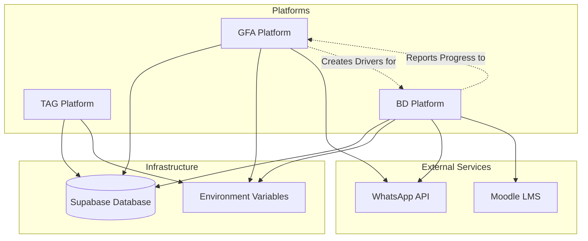

# TAG Ecosystem — Integration Dependency Map

This document outlines the critical dependencies between the platforms and external services in the TAG ecosystem. Understanding these dependencies is crucial for a successful deployment and testing phase.

## The Core Principle: Sequence Matters

The three platforms (TAG, GFA, BD) are not isolated silos; they are deeply interconnected and rely on shared infrastructure and external services. Attempting to test a feature before its underlying dependencies are configured will result in errors that appear to be code bugs but are actually sequencing failures.

## Visual Dependency Map

## Critical Dependency Chains

### 1. The Database Foundation

**Dependency:** All platforms depend on the Supabase database being fully deployed, with RLS enabled and seed data inserted.

**Failure Mode:** If the database is not set up, no platform will function. Admin logins will fail, company registrations will fail, and driver onboarding will fail.

**Gate:** Do not attempt to start any platform until the `09-SUPABASE-VERIFICATION.sql` queries return the expected results.

### 2. The WhatsApp Communication Chain

**Dependency:** GFA and BD depend on the WhatsApp API being configured with the correct templates and the `META_WA_ACCESS_TOKEN` being set.

**Failure Mode:** If WhatsApp is not configured, GFA cannot send magic links to drivers, and BD cannot send welcome messages or inactivity reminders. The driver onboarding flow will break silently.

**Gate:** Do not attempt to deploy drivers from GFA or test the BD magic link flow until the WhatsApp templates are approved in Meta Business Manager and the environment variables are set.

### 3. The Moodle Integration Chain

**Dependency:** BD depends on Moodle being fully configured, including the Outgoing Webhooks plugin, the `MOODLE_URL`, and the `MOODLE_TOKEN`.

**Failure Mode:** If Moodle is not configured, BD cannot create Moodle users when drivers click their magic links, and progress will not sync back to the BD portal.

**Gate:** Do not attempt to test the driver onboarding flow or course progress tracking until the Moodle integration is fully verified.

### 4. The Platform Interdependency Chain

**Dependency:** BD relies on GFA to create driver records and generate magic links. GFA relies on BD to track driver progress and report it back to the company portal.

**Failure Mode:** You cannot test BD in isolation without first creating a driver in GFA. You cannot test GFA's reporting features without first simulating progress in BD.

**Gate:** Follow the End-to-End Testing Checklist strictly. It is designed to test the platforms in the correct sequence, respecting these interdependencies.
